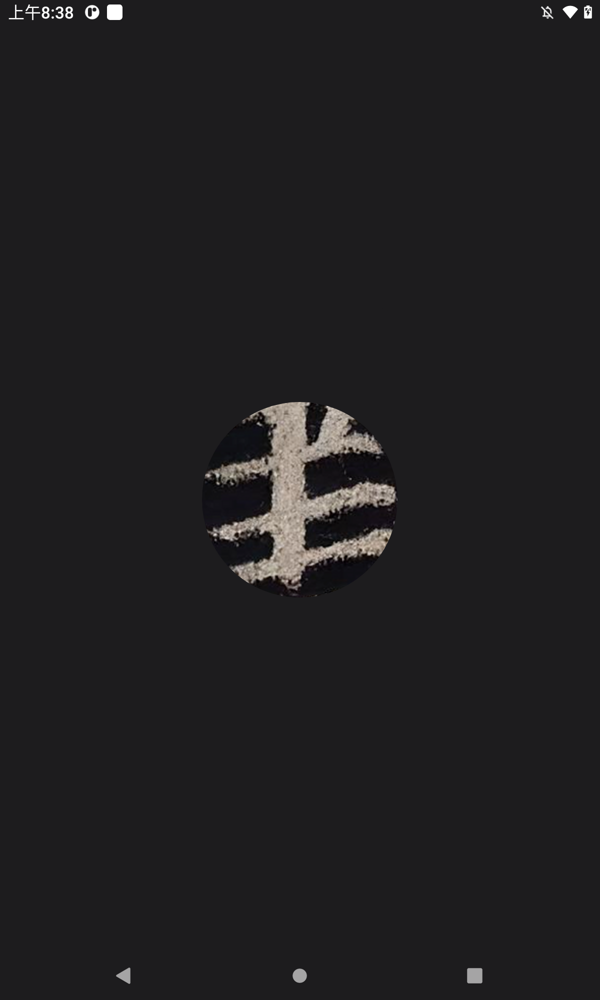
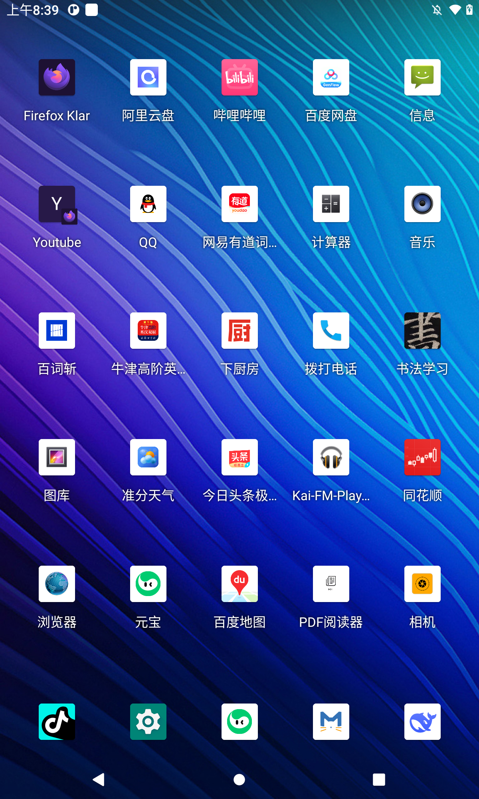

# 书法学习

一款面向手机和平板的书法学习 Android 应用，支持「选贴」与「看贴」两大核心功能。数据来源于 [字帖网](https://www.zitiewang.com/)、[雅策](http://www.yac8.com/wap/)、[快书法](https://www.kshufa.com/)，功能参考「不厌书法」「书法字典大全」等应用。

## 功能特性

- **选贴**：按字体（篆 / 隶 / 楷 / 行 / 草）筛选字帖，支持搜索贴名、作者、年代
- **看贴**：整帖多图浏览 + 碑帖详细介绍双标签页
- **全屏查看**：横滑翻页、捏合缩放、页码快速跳转
- **网络搜索**：本地无结果时自动搜索字帖网，可一键添加到本地
- **开屏画面**：品牌 logo 开屏，避免白屏
- **本地数据库**：Room 持久化，支持大数据量下的快速查询

## 界面截图

| 选贴页面 | 看贴 · 整帖查看 |
| :---: | :---: |
|  |  |

| 看贴 · 碑帖介绍 | 全屏查看 |
| :---: | :---: |
|  |  |

## 技术栈

- **Kotlin** + **Jetpack Compose** + **Material 3**
- **MVVM** 架构（ViewModel + StateFlow）
- **Room** 数据库（KSP 注解处理）
- **Coil** 图片加载
- Compose Navigation 单 Activity 架构

## 项目结构

```
app/src/main/java/com/example/shufa/
├── MainActivity.kt              # 入口 Activity（含开屏）
├── model/CalligraphyPost.kt     # 字帖数据模型 + 字体枚举
├── data/
│   ├── PostRepository.kt        # 数据仓库
│   └── db/                      # Room 实体、DAO、数据库
├── navigation/NavGraph.kt       # 路由导航
└── ui/
    ├── theme/                   # M3 主题
    ├── select/                  # 选贴界面
    └── view/                    # 看贴界面
```

## 构建与运行

```bash
./gradlew assembleDebug          # 构建 debug APK
adb install -r app/build/outputs/apk/debug/app-debug.apk   # 安装
adb shell am start -n com.example.shufa/.MainActivity       # 启动
```

## 数据来源

字帖数据（图片、介绍文字）来源于以下网站，版权归原作者所有，仅供学习交流：

- **字帖网** (https://www.zitiewang.com/) — 碑帖图片、详细介绍
- **雅策** (http://www.yac8.com/wap/) — 补充参考
- **快书法** (https://www.kshufa.com/) — 补充参考

## 说明

- 应用内字体风格默认选中「隶」，筛选顺序为：全部、篆、隶、楷、行、草
- V2 及以后的功能（临摹、评测、社区等）暂未实现
